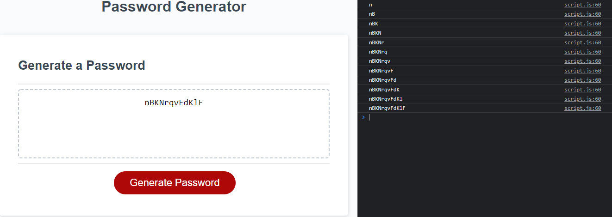

# Random Password Generator

## Deployment
- [GitHub Repository](https://github.com/cn-kp/Password-Generator)
- [GitHub Deployed Link](https://cn-kp.github.io/Passowrd-Generator/)

## Description

This application was created for users to generate a random password based on a set of criteria selected by the user. When the page is loaded, the simplistic and intuitive UI design is indicative of the use of the application. The user will be required to select the options for the desire password and on "Generate", will create a password based on the requirements. 

## Features
- User input
- Simple UI
- Console log of Password Being Generated

## Applications used

- Javascript
- Css
- HTML

## Demo

A preview of the site is attached below; 
 

